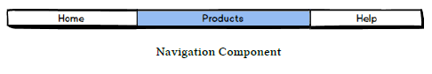

# Ng-Book The Complete Guide to Angular

## 1. How to read this book
## 2. Writing your first angular web application
## 3. TypeScript
## 4. How Angular Works
## 5. Built-in Directives
## 6. Forms in Angular
## 7. Dependency Injection
## 8. HTTP
## 9. Routing
## 10. Data Architecture in Angular
## 11. Data Architecture with Observables - Part 1: Services
## 12. Data Architecture with Observables - Part 2: View Components
## 13. Introduction to Redux with TypeScript
## 14. Intermediate Redux in Angular
## 15. Advanced components
## 16. Testing
## 17. Converting an AngularJS 1.x App to angular
## 18. NativeScript: Mobile Applications for the angular developer

---
---

# 1. How to read this book

\-

# 4. How Angular Works

## Application

An Angular Application is nothing more than a tree of Components.

At the root of that tree, the top level Component is the application itself. And that’s what the browser will render when “booting” (a.k.a bootstrapping) the app.

One of the great things about Components is that they’re composable. This means that we can build up larger Components from smaller ones. The Application is simply a Component that renders other Components.

Because Components are structured in a parent/child tree, when each Component renders, it recursively renders its children Components.

For example, let’s create a simple inventory management application that is represented by the following page mockup:

Given this mockup, to write this application the first thing we want to do is split it into components.

In this example, we could group the page into three high level components

1. The Navigation Component

2. The Breadcrumbs Component

3. The Product List Component

### The Navigation Component

This component would render the navigation section. This would allow the user to visit other areas of the application.

### The Breadcrumbs Component

This would render a hierarchical representation of where in the application the user currently is.

### The Product List Component

The Products List component would be a representation of a collection of products.

Breaking this component down into the next level of smaller components, we could say that the Product List is composed of multiple Product Rows.

And of course, we could continue one step further, breaking each Product Row into smaller pieces:

• the Product Image component would be responsible for rendering a product image, given its image name

• the Product Department component would render the department tree, like Men > Shoes > Running Shoes

• the Price Display component would render the price. Imagine that our implementation customizes the pricing if the user is logged in to include system-wide tier discounts or include shipping for instance. We could implement all this behavior into this component.

Finally, putting it all together into a tree representation, we end up with the following diagram:

The rest is outdated.